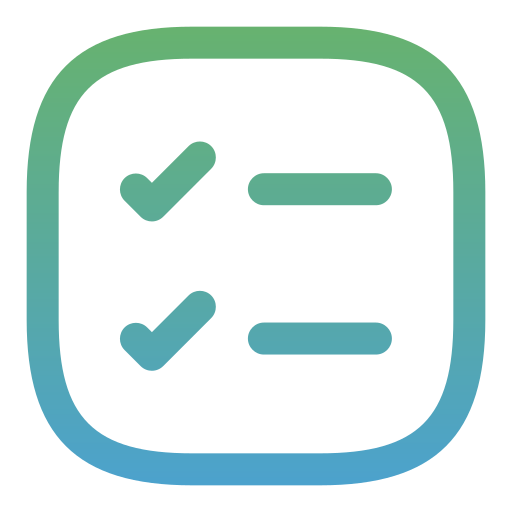

#  Taskit

Taskit is a simple, elegant, and minimalistic To-Do List web application built using vanilla frontend web technologies. It now features complete user authentication and real-time cloud data persistence.

---

## 🌐 Live Demo

Check out the live version here: [https://taskit-do.vercel.app/](https://taskit-do.vercel.app/)

---

## ✨ Features

- **User Authentication:** Securely sign up or sign in to manage your personal tasks.
- **Task Management:** Create, edit, and delete tasks seamlessly.
- **Task Statuses:** Mark tasks as completed with a visual cross-out animation.
- **Deadlines:** Assign specific completion dates to your tasks with an embedded calendar picker.
- **Theme Toggling:** Switch between light mode and dark mode layouts based on your preference.
- **Responsive Design:** Fully optimized with a fluid interface for both desktop and mobile layouts.

---

## 🛠️ Technologies Used

- **HTML:** Semantic structure.
- **CSS:** Custom properties, CSS Grid/Flexbox, animations, and dark mode styling.
- **JavaScript:** Vanilla asynchronous DOM manipulation and event-driven architecture.
- **Supabase:** Backend-as-a-Service handling User Authentication and Postgres Database storage.

---

## 🚀 Getting Started

Follow these steps to run the project locally on your machine:

### 1. Clone the Repository
```bash
git clone [https://github.com/OuassimDev/taskit.git](https://github.com/OuassimDev/taskit.git)
cd taskit